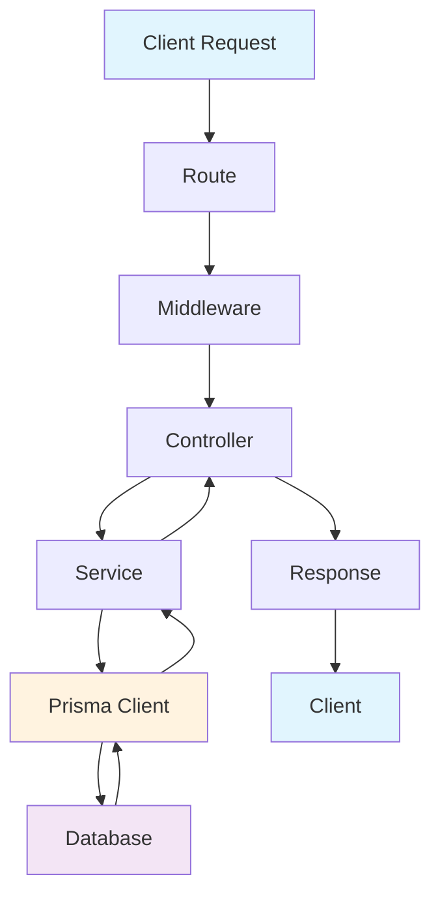
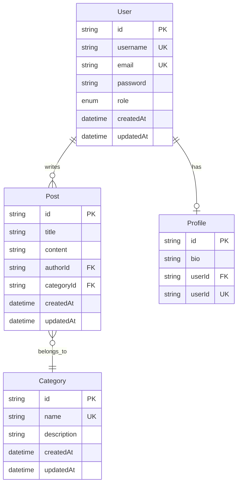
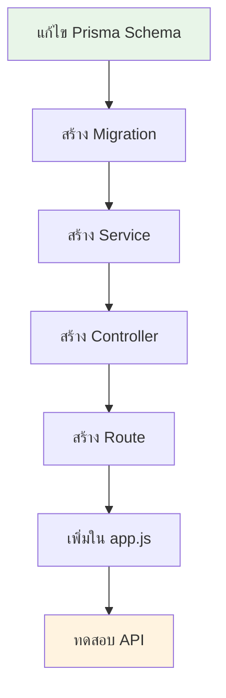
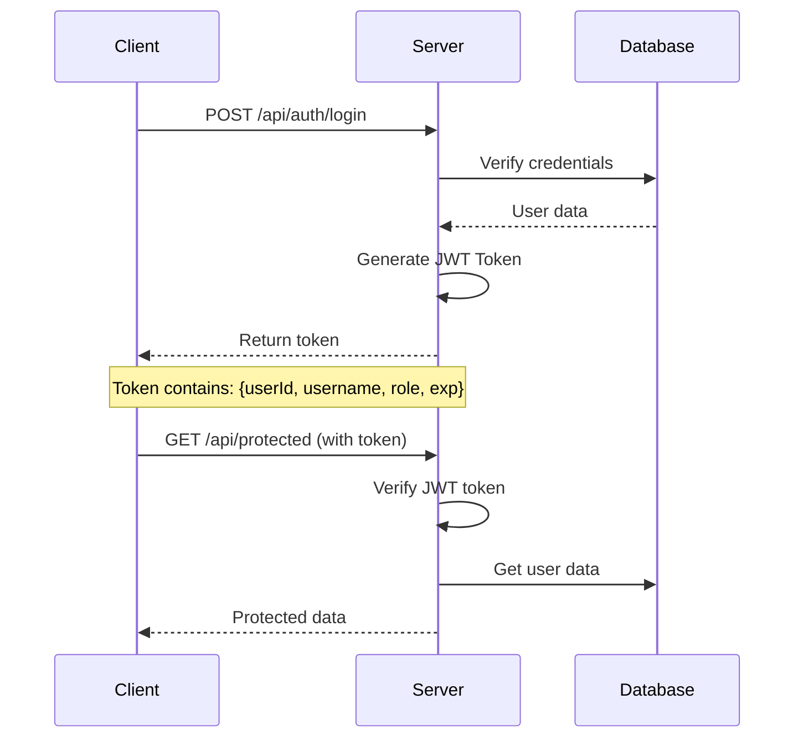
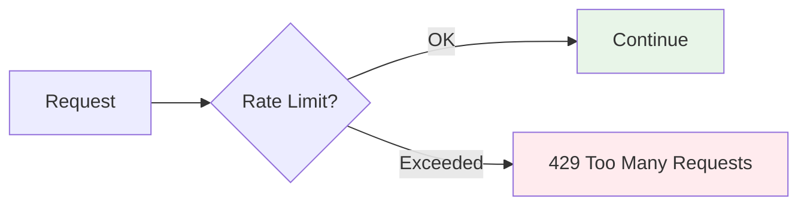
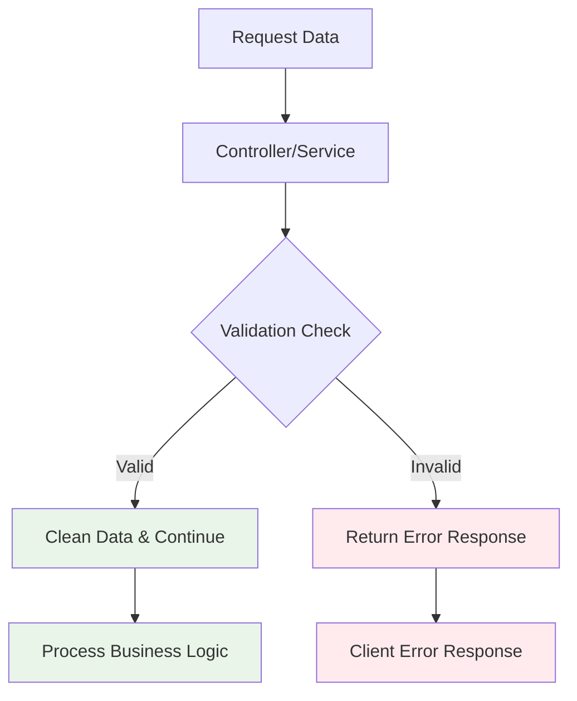
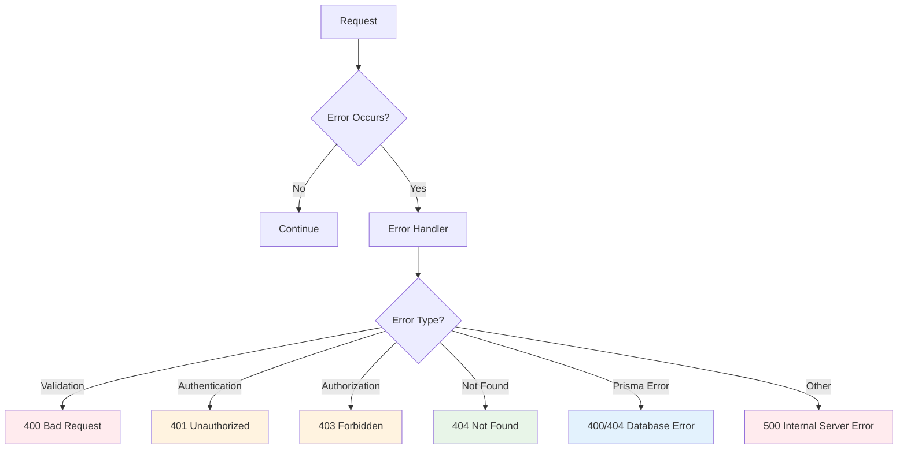

# คู่มือการพัฒนา Backend API ด้วย Node.js, Express และ Prisma

## บทที่ 1: โครงสร้างโปรเจคและสถาปัตยกรรม

### โครงสร้างโปรเจค
```
backend/
├── src/
│   ├── controllers/     # ควบคุมการทำงานของ API
│   ├── services/        # ตรรกะทางธุรกิจ
│   ├── routes/          # กำหนดเส้นทาง API
│   ├── middleware/      # ตัวกลางประมวลผล
│   ├── config/          # การตั้งค่า
│   └── utils/           # ฟังก์ชันช่วยเหลือ
├── prisma/              # ฐานข้อมูลและ migration
└── package.json         # dependencies และ scripts
```

### สถาปัตยกรรมแบบ MVC + Service Layer



**Flow การทำงาน:**
- **Route**: กำหนดเส้นทาง API
- **Middleware**: ประมวลผลก่อนถึง controller (auth, validation, rate limiting)
- **Controller**: รับ request และส่ง response
- **Service**: จัดการตรรกะทางธุรกิจ
- **Prisma Client**: เชื่อมต่อกับฐานข้อมูล

---

## บทที่ 2: การจัดการฐานข้อมูลด้วย Prisma

### คำสั่ง Prisma ที่สำคัญ

#### 1. การติดตั้งและสร้าง Prisma Client
```bash
# ติดตั้ง Prisma
npm install prisma @prisma/client

# เริ่มต้น Prisma
npx prisma init

# สร้าง Prisma Client
npx prisma generate
```

#### 2. การจัดการ Migration
```bash
# สร้าง migration ใหม่
npx prisma migrate dev --name migration_name

# รัน migration ใน production
npx prisma migrate deploy

# รีเซ็ตฐานข้อมูล (development only)
npx prisma migrate reset

# ดูสถานะ migration
npx prisma migrate status
```

#### 3. การจัดการฐานข้อมูล
```bash
# เปิด Prisma Studio (GUI)
npx prisma studio

# รัน seed data
npx prisma db seed

# Push schema ไปยังฐานข้อมูล (development)
npx prisma db push
```

### ตัวอย่างการเขียน Prisma Schema

#### Model พื้นฐาน
```prisma
model User {
  id        String   @id @default(uuid())
  username  String   @unique
  email     String   @unique
  password  String
  role      Role     @default(USER)
  createdAt DateTime @default(now())
  updatedAt DateTime @updatedAt

  @@map("users")
}

enum Role {
  ADMIN
  USER
}
```
[Prisma Schema Reference](https://www.prisma.io/docs/orm/reference/prisma-schema-reference "Prisma Schema Reference")

#### ความสัมพันธ์ระหว่าง Model




```prisma
model User {
  id       String    @id @default(uuid())
  name     String
  posts    Post[]    // One-to-Many
  profile  Profile?  // One-to-One
}

model Post {
  id         String   @id @default(uuid())
  title      String
  content    String
  authorId   String
  author     User     @relation(fields: [authorId], references: [id])
  categoryId String?
  category   Category? @relation(fields: [categoryId], references: [id])
}

model Profile {
  id     String @id @default(uuid())
  bio    String?
  userId String @unique
  user   User   @relation(fields: [userId], references: [id])
}

model Category {
  id       String @id @default(uuid())
  name     String @unique
  posts    Post[]
```


## บทที่ 3: การเพิ่ม Feature ใหม่

### ขั้นตอนการเพิ่ม Feature



#### 1. แก้ไข Prisma Schema
```prisma
// เพิ่ม model ใหม่ใน schema.prisma
model Category {
  id          String    @id @default(uuid())
  name        String    @unique
  description String?
  products    Product[]
  createdAt   DateTime  @default(now())
  updatedAt   DateTime  @updatedAt

  @@map("categories")
}

// แก้ไข model ที่มีอยู่เพื่อเพิ่มความสัมพันธ์
model Product {
  id         String   @id @default(uuid())
  name       String
  price      Decimal  @db.Decimal(10, 2)
  categoryId String?
  category   Category? @relation(fields: [categoryId], references: [id])
  
  @@map("products")
}
```

#### 2. สร้าง Migration และ Genarate Prisma Client
```bash
npx prisma migrate dev --name add_category_table
npx prisma generate
```

#### 3. สร้าง Service
```javascript
// src/services/CategoryService.js
const { PrismaClient } = require('@prisma/client');
const prisma = new PrismaClient();

class CategoryService {
  static async create(data) {
    return await prisma.category.create({
      data: {
        name: data.name,
        description: data.description
      }
    });
  }

  static async findAll() {
    return await prisma.category.findMany({
      include: {
        products: true
      }
    });
  }

  static async findById(id) {
    return await prisma.category.findUnique({
      where: { id },
      include: {
        products: true
      }
    });
  }

  static async update(id, data) {
    return await prisma.category.update({
      where: { id },
      data
    });
  }

  static async delete(id) {
    return await prisma.category.delete({
      where: { id }
    });
  }
}

module.exports = CategoryService;
```

#### ตัวอย่างและคำอธิบาย Prisma Client Methods ที่ใช้บ่อย

<table>
  <tr>
    <th>Method</th>
    <th>คำอธิบาย</th>
    <th>ตัวอย่างการใช้งาน</th>
  </tr>
  <tr>
    <td><b>create</b></td>
    <td>สร้างข้อมูลใหม่ 1 รายการ</td>
    <td>
      <pre><code>
await prisma.category.create({
    data: { 
    name: "อาหาร",
    description: "หมวดอาหาร" 
  }
})
      </code></pre>
      </td>
  </tr>
  <tr>
    <td><b>createMany</b></td>
    <td>สร้างข้อมูลใหม่หลายรายการ</td>
    <td>
        <pre><code>
await prisma.category.createMany({
    data: [{
        name: "อาหาร"
    }, {
        name: "เครื่องดื่ม"
    }]
})
        </code></pre></td>
  </tr>
  <tr>
    <td><b>findUnique</b></td>
    <td>ค้นหาข้อมูล 1 รายการ โดยใช้ key ที่ unique (เช่น id หรือ name)</td>
    <td>
        <pre><code>
await prisma.category.findUnique({
    where: {
        id: "..."
    }
})
        </code></pre></td>
  </tr>
  <tr>
    <td><b>findFirst</b></td>
    <td>ค้นหาข้อมูล 1 รายการแรกที่ตรงเงื่อนไข</td>
    <td>
        <pre><code>
await prisma.category.findFirst({
    where: { name: { contains: "อา" } }
})
        </code></pre></td>
  </tr>
  <tr>
    <td><b>findMany</b></td>
    <td>ค้นหาข้อมูลหลายรายการ</td>
    <td>
        <pre><code>
await prisma.category.findMany({
    where: { name: { contains: "อา" } }
})
        </code></pre></td>
  </tr>
  <tr>
    <td><b>update</b></td>
    <td>อัปเดตข้อมูล 1 รายการ</td>
    <td>
        <pre><code>
await prisma.category.update({
    where: { id: "..." },
    data: { name: "ใหม่" }
})
        </code></pre></td>
  </tr>
  <tr>
    <td><b>updateMany</b></td>
    <td>อัปเดตข้อมูลหลายรายการ</td>
    <td>
        <pre><code>
await prisma.category.updateMany({
    where: { name: "อาหาร" },
    data: { description: "หมวดอาหาร" }
})
        </code></pre></td>
  </tr>
  <tr>
    <td><b>upsert</b></td>
    <td>ถ้ามีข้อมูลอยู่แล้วให้อัปเดต ถ้าไม่มีให้สร้างใหม่</td>
    <td>
        <pre><code>
await prisma.category.upsert({
    where: { id: "..." },
    update: { name: "ใหม่" },
    create: { name: "ใหม่" }
})
        </code></pre></td>
  </tr>
  <tr>
    <td><b>delete</b></td>
    <td>ลบข้อมูล 1 รายการ</td>
    <td>
        <pre><code>
await prisma.category.delete({
    where: { id: "..." }
})
        </code></pre></td>
  </tr>
  <tr>
    <td><b>deleteMany</b></td>
    <td>ลบข้อมูลหลายรายการ</td>
    <td>
        <pre><code>
await prisma.category.deleteMany({
    where: { name: "อาหาร" }
})
        </code></pre></td>
  </tr>
  <tr>
    <td><b>count</b></td>
    <td>นับจำนวนข้อมูล</td>
    <td>
        <pre><code>
await prisma.category.count({
    where: { name: { contains: "อา" } }
})
        </code></pre></td>
  </tr>
  <tr>
    <td><b>aggregate</b></td>
    <td>คำนวณค่ารวม เช่น sum, avg, min, max</td>
    <td>
        <pre><code>
await prisma.category.aggregate({
    _count: true,
    _min: { createdAt: true }
})
        </code></pre></td>
  </tr>
  <tr>
    <td><b>groupBy</b></td>
    <td>จัดกลุ่มข้อมูล</td>
    <td>
        <pre><code>
await prisma.category.groupBy({
    by: ["name"],
    _count: { _all: true }
})
        </code></pre></td>
  </tr>
</table>

<blockquote>
<b>หมายเหตุ:</b> ทุก method สามารถเพิ่ม <code>include</code> หรือ <code>select</code> เพื่อดึงข้อมูลความสัมพันธ์ เช่น products ได้ เช่น<br>
<pre><code>await prisma.category.findMany({
  include: { products: true }
})
</code></pre>
</blockquote>

[Prisma Client API Reference](https://www.prisma.io/docs/orm/reference/prisma-client-reference "Prisma Client API")

---


#### 4. สร้าง Controller
```javascript
// src/controllers/CategoryController.js
const CategoryService = require('@/services/CategoryService');

class CategoryController {
  static async create(req, res, next) {
    try {
      const category = await CategoryService.create(req.body);
      res.status(201).json({
        success: true,
        message: 'Category created successfully',
        data: category
      });
    } catch (error) {
      next(error);
    }
  }

  static async getAll(req, res, next) {
    try {
      const categories = await CategoryService.findAll();
      res.json({
        success: true,
        data: categories
      });
    } catch (error) {
      next(error);
    }
  }

  static async getById(req, res, next) {
    try {
      const category = await CategoryService.findById(req.params.id);
      if (!category) {
        return res.status(404).json({
          success: false,
          error: 'Category not found'
        });
      }
      res.json({
        success: true,
        data: category
      });
    } catch (error) {
      next(error);
    }
  }

  static async update(req, res, next) {
    try {
      const category = await CategoryService.update(req.params.id, req.body);
      res.json({
        success: true,
        message: 'Category updated successfully',
        data: category
      });
    } catch (error) {
      next(error);
    }
  }

  static async delete(req, res, next) {
    try {
      await CategoryService.delete(req.params.id);
      res.json({
        success: true,
        message: 'Category deleted successfully'
      });
    } catch (error) {
      next(error);
    }
  }
}

module.exports = CategoryController;
```

#### 5. สร้าง Route
```javascript
// src/routes/categoryRoutes.js
const express = require('express');
const CategoryController = require('@/controllers/CategoryController');
const { authenticateToken } = require('@/middleware/auth');

const router = express.Router();

// Public routes
router.get('/', CategoryController.getAll);
router.get('/:id', CategoryController.getById);

// Protected routes (ต้อง login)
router.post('/', authenticateToken, CategoryController.create);
router.put('/:id', authenticateToken, CategoryController.update);
router.delete('/:id', authenticateToken, CategoryController.delete);

module.exports = router;
```

#### 6. เพิ่ม Route ใน app.js
```javascript
// src/app.js
const categoryRoutes = require('@/routes/categoryRoutes');

// เพิ่มบรรทัดนี้ในส่วน API Routes
app.use('/api/categories', categoryRoutes);
```

---

## บทที่ 4: การจัดการ Authentication และ Authorization

### JWT Token Structure



```javascript
// สร้าง JWT Token
const jwt = require('jsonwebtoken');

const token = jwt.sign(
  { 
    userId: user.id, 
    username: user.username,
    role: user.role 
  },
  process.env.JWT_SECRET,
  { expiresIn: '24h' }
);
```

### Middleware Authentication
```javascript
// src/middleware/auth.js
const jwt = require('jsonwebtoken');

const authenticateToken = (req, res, next) => {
  const authHeader = req.headers['authorization'];
  const token = authHeader && authHeader.split(' ')[1];

  if (!token) {
    return res.status(401).json({
      success: false,
      error: 'Access token required'
    });
  }

  jwt.verify(token, process.env.JWT_SECRET, (err, user) => {
    if (err) {
      return res.status(403).json({
        success: false,
        error: 'Invalid or expired token'
      });
    }
    req.user = user;
    next();
  });
};

const authorizeRole = (roles) => {
  return (req, res, next) => {
    if (!req.user) {
      return res.status(401).json({
        success: false,
        error: 'Authentication required'
      });
    }

    if (!roles.includes(req.user.role)) {
      return res.status(403).json({
        success: false,
        error: 'Insufficient permissions'
      });
    }

    next();
  };
};

module.exports = { authenticateToken, authorizeRole };
```

### การใช้งาน Authorization
```javascript
// ใช้ใน route เพื่อจำกัดสิทธิ์
router.post('/admin-only', 
  authenticateToken, 
  authorizeRole(['ADMIN', 'SUPER_ADMIN']), 
  AdminController.create
);
```

---


## บทที่ 5: การจัดการ Rate Limiting

### Rate Limiting Middleware



```javascript
const rateLimit = require('express-rate-limit');

// Create rate limiter with custom config
const createRateLimit = (maxRequests = 50, windowSeconds = 60) => {
  return rateLimit({
    windowMs: windowSeconds * 1000, // Convert seconds to milliseconds
    limit: maxRequests, // Limit each IP to maxRequests requests per windowMs
    message: {
      error: 'Too many requests',
      message: `You have exceeded the ${maxRequests} requests in ${windowSeconds} seconds limit!`,
      retryAfter: Math.ceil(windowSeconds)
    },
    standardHeaders: true, // Return rate limit info in the `RateLimit-*` headers
    legacyHeaders: false, // Disable the `X-RateLimit-*` headers
    // Skip successful requests (optional)
    skip: (request, response) => response.statusCode < 400,
    // Custom key generator (optional - defaults to IP)
    keyGenerator: (request, response) => {
      return request.fingerprint || request.ip;
    }
  });
};

// Default rate limiter: 50 requests per 60 seconds
const defaultRateLimit = createRateLimit(50, 60);

// Stricter rate limiter for auth endpoints: 10 requests per 60 seconds
const authRateLimit = createRateLimit(10, 60);

// Very strict rate limiter for password reset: 3 requests per 300 seconds (5 minutes)
const passwordResetRateLimit = createRateLimit(3, 300);

// Decorator function like requireRole - allows custom rate limiting per route
const rateLimitMiddleware = (maxRequests = 50, windowSeconds = 60) => {
  return createRateLimit(maxRequests, windowSeconds);
};

module.exports = {
  createRateLimit,
  defaultRateLimit,
  authRateLimit,
  passwordResetRateLimit,
  rateLimit: rateLimitMiddleware
};
```

### การใช้งาน Rate-Limit
```javascript
// ใช้ใน route เพื่อตั้งค่าจำนวนครั้งต่อเวลาใดๆ
router.post('/admin-only', 
  rateLimit(10, 60),
  AdminController.create
);
```

---


## บทที่ 6: การจัดการ Validation Utilities 

### ภาพรวมของ Validation System



### โครงสร้างไฟล์ Validation

```
src/
├── utils/
│ └── validation.js # Validation utilities สำหรับข้อมูลไทย
└── controllers/ # ใช้งาน validation ใน controller
└── services/ # ใช้งาน validation ใน service
```

**กฎการตรวจสอบเบอร์มือถือไทย:**
- ✅ ต้องขึ้นต้นด้วย `0`
- ✅ หลักที่ 2 ต้องเป็น `6`, `8`, หรือ `9`
- ✅ ต้องมีทั้งหมด 10 หลัก
- ✅ รองรับการใส่เครื่องหมายขีด, ช่องว่าง, และวงเล็บ


**กฎการตรวจสอบเลขบัตรประจำตัวประชาชนไทย:**
- ✅ ต้องมีทั้งหมด 13 หลัก
- ✅ ต้องเป็นตัวเลขทั้งหมด
- ✅ ต้องผ่านการตรวจสอบ checksum ตามสูตรของกรมการปกครอง

### 1. การใช้งานใน Controller

```javascript
// ตัวอย่างการใช้งานใน PostController หรือ CategoryController
const ValidationUtil = require('@/utils/validation');

class PostController {
  static async create(req, res, next) {
    try {
      const { title, content, phoneNumber, nationalID } = req.body;
      
      // Validation สำหรับข้อมูลที่จำเป็น
      if (!title || !content) {
        return res.status(400).json({
          success: false,
          error: 'Title and content are required'
        });
      }

      // Validation เบอร์มือถือ (ถ้ามี)
      if (phoneNumber && !ValidationUtil.validateThaiPhoneNumber(phoneNumber)) {
        return res.status(400).json({
          success: false,
          error: ValidationUtil.getPhoneNumberErrorMessage('phoneNumber')
        });
      }

      // Validation เลขบัตรประจำตัวประชาชน (ถ้ามี)
      if (nationalID && !ValidationUtil.validateThaiNationalID(nationalID)) {
        return res.status(400).json({
          success: false,
          error: ValidationUtil.getNationalIDErrorMessage('nationalID')
        });
      }

      // ทำความสะอาดข้อมูล (ถ้ามี)
      const cleanData = {
        title,
        content,
        authorId: req.user.id
      };

      if (phoneNumber) {
        cleanData.phoneNumber = ValidationUtil.cleanThaiPhoneNumber(phoneNumber);
      }

      if (nationalID) {
        cleanData.nationalID = ValidationUtil.cleanThaiNationalID(nationalID);
      }

      const post = await PostService.create(cleanData);
      
      res.status(201).json({
        success: true,
        message: 'Post created successfully',
        data: post
      });
    } catch (error) {
      next(error);
    }
  }
}
```

### 2. การใช้งานใน Service
```javascript
// ตัวอย่างการใช้งานใน PostService
const ValidationUtil = require('@/utils/validation');

class PostService {
  static async create(data) {
    // Validation ใน service level
    if (data.phoneNumber && !ValidationUtil.validateThaiPhoneNumber(data.phoneNumber)) {
      throw new Error('Invalid phone number format');
    }

    if (data.nationalID && !ValidationUtil.validateThaiNationalID(data.nationalID)) {
      throw new Error('Invalid national ID format');
    }

    // ทำความสะอาดข้อมูลก่อนบันทึก
    const cleanData = { ...data };
    
    if (data.phoneNumber) {
      cleanData.phoneNumber = ValidationUtil.cleanThaiPhoneNumber(data.phoneNumber);
    }

    if (data.nationalID) {
      cleanData.nationalID = ValidationUtil.cleanThaiNationalID(data.nationalID);
    }

    return await prisma.post.create({
      data: cleanData,
      include: {
        author: {
          select: {
            id: true,
            username: true,
            firstName: true,
            lastName: true
          }
        }
      }
    });
  }
}
```

### 3. ตัวอย่างข้อมูลที่รองรับ

#### เบอร์มือถือไทย
```javascript
// ✅ ข้อมูลที่ถูกต้อง
'0812345678'      // 10 หลัก, ขึ้นต้นด้วย 0
'0912345678'      // 10 หลัก, ขึ้นต้นด้วย 0
'0612345678'      // 10 หลัก, ขึ้นต้นด้วย 0
'08-123-4567'     // มีเครื่องหมายขีด (จะถูกทำความสะอาด)
'08 123 4567'     // มีช่องว่าง (จะถูกทำความสะอาด)
'(08)123-4567'    // มีวงเล็บ (จะถูกทำความสะอาด)

// ❌ ข้อมูลที่ไม่ถูกต้อง
'081234567'       // ไม่ครบ 10 หลัก
'1812345678'      // ไม่ขึ้นต้นด้วย 0
'08123456789'     // เกิน 10 หลัก
'081234567a'      // มีตัวอักษร
```

#### เลขบัตรประจำตัวประชาชนไทย
```javascript
// ✅ ข้อมูลที่ถูกต้อง
'1234567890121'           // 13 หลัก, checksum ผ่าน
'123-456-789-012-1'      // มีเครื่องหมายขีด (จะถูกทำความสะอาด)
'123 456 789 012 1'      // มีช่องว่าง (จะถูกทำความสะอาด)

// ❌ ข้อมูลที่ไม่ถูกต้อง
'1234567890123'           // checksum ไม่ผ่าน
'123456789012'            // ไม่ครบ 13 หลัก
'12345678901234'          // เกิน 13 หลัก
'123456789012a'           // มีตัวอักษร
```

---


## บทที่ 7: การใช้ Upload file Utilities

Work in progress

---

## บทที่ 8: การจัดการ Error

### Global Error Handler



```javascript
// src/app.js
app.use((err, req, res, next) => {
  console.error('Error:', err);
  
  // Prisma Errors
  if (err.code === 'P2002') {
    return res.status(400).json({
      success: false,
      error: 'Duplicate field value'
    });
  }
  
  if (err.code === 'P2025') {
    return res.status(404).json({
      success: false,
      error: 'Record not found'
    });
  }
  
  // Validation Errors
  if (err.name === 'ValidationError') {
    return res.status(400).json({
      success: false,
      error: 'Validation Error',
      details: err.message
    });
  }
  
  // Default error
  res.status(500).json({
    success: false,
    error: 'Internal Server Error'
  });
});
```

---

## บทที่ 9: การ Deploy และ Production

Work in progress

---

## คำสั่งที่ใช้บ่อย

```bash
# Development
npm run dev                    # รัน server ในโหมด development
npm run build                 # Build โปรเจค
npm run prisma:generate      # สร้าง Prisma Client
npm run prisma:migrate       # รัน migration
npm run prisma:studio        # เปิด Prisma Studio
npm run prisma:seed          # รัน seed data

# Database
npx prisma migrate dev       # สร้างและรัน migration
npx prisma migrate reset     # รีเซ็ตฐานข้อมูล
npx prisma db push           # Push schema ไปยังฐานข้อมูล
npx prisma db seed           # รัน seed data

# Production
npm start                     # รัน server ในโหมด production
npm run build                # Build โปรเจค
```